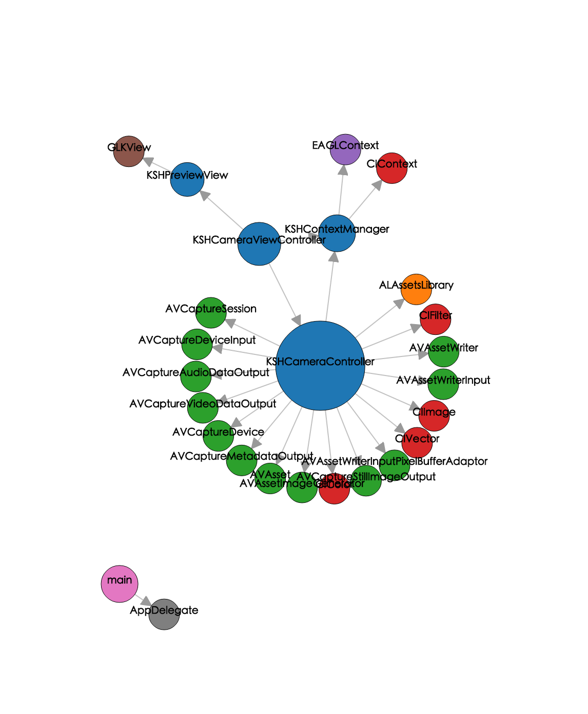
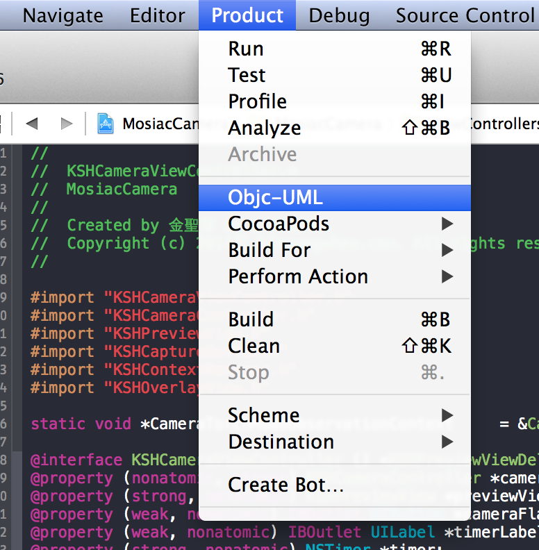

## KSHObjcUML
---
KSHObjcUML can show oriented graph of dependencies between Objective-C classes in your project.
This plugin is based on [objc-dependency-visualizer](https://github.com/PaulTaykalo/objc-dependency-visualizer).

##Changes
---
### 2015-02-21
 - bug fixed of project name have whitespace
 - set default show dependencies classes name 

## Usage
---
###Step 1 - Build your Xcode project
###Step 2 - Select Product->Objc-UML

## Install
---
Install via [Alcatraz](http://alcatraz.io/)

OR

Clone and build the project, then restart Xcode.

## Uninstall
---
Uninstall via [Alcatraz](http://alcatraz.io/)

OR

Run `rm -r ~/Library/Application\ Support/Developer/Shared/Xcode/Plug-ins/KSHObjcUML.xcplugin/`

## Thanks
---
Thanks to kattrali.[cocoapods-xcode-plugin](https://github.com/kattrali/cocoapods-xcode-plugin).

Thanks to Paul Taykalo.[objc-dependency-visualizer](https://github.com/PaulTaykalo/objc-dependency-visualizer).

## License
---
KSHObjcUML is available under the MIT license. See the LICENSE file for more info.
